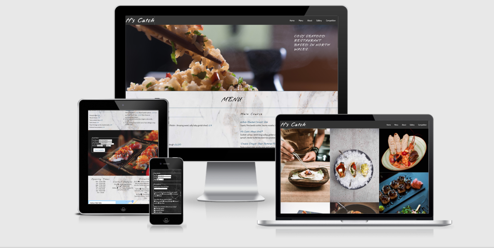
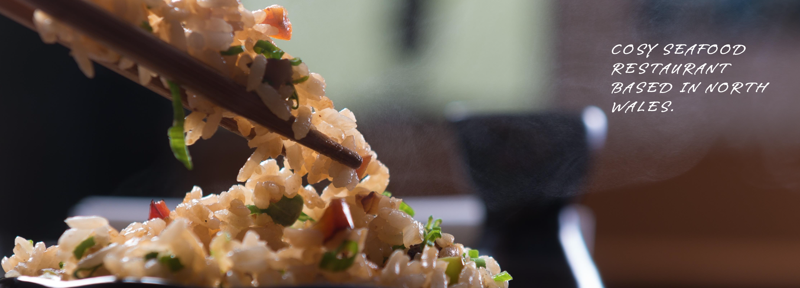
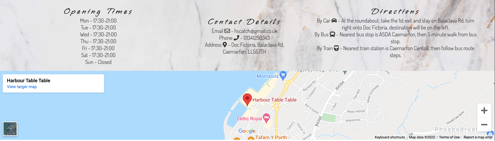
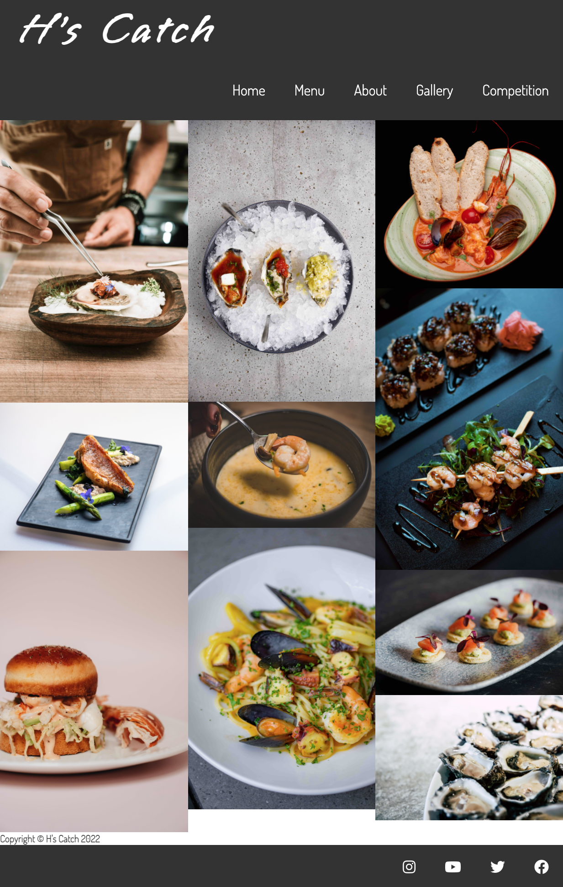
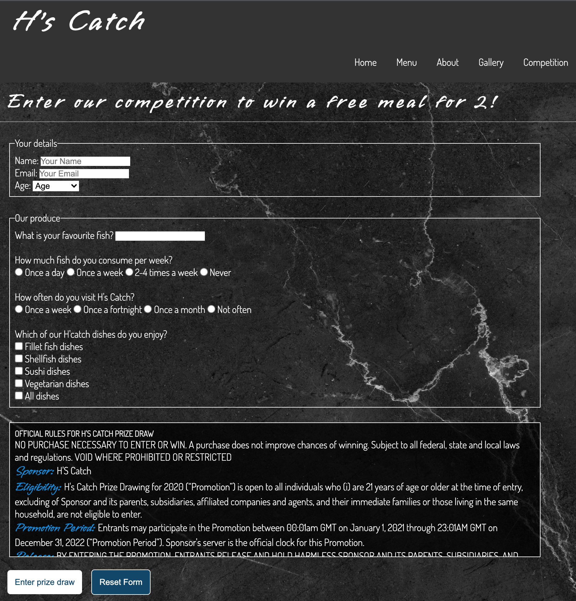

# H's Catch

H's Catch is a website for a seafood restaurant based in North Wales. The site will be targeted towards people looking to dine out in Caernarfon, Wales area. The website aims to be informative with a sample menu, a section with contact details, opening times, directions and a map. With many food images within the different pages to show the type of food that will be served at this restaurant.
## Features 

The website features 3 different pages - Home, Gallery and a Competition.

### Home page
The home page features a short description, a sample menu, a quick book feature and information about the restaurant. The design is simple, easy to read and as a restaurant website, the images entice the user to scroll down. The dish options on the menu are highlighted with the description underneath to give the user quick reading (so if a certain dish isn't to the user preference, they can just read past). The quick book feature allows the user to quickly book a table without hassle of contacting the restaurant. The about section provides further details such as opening times, contact details, directions with an interactive map allowing the user to easily contact for further requests and how to locate the restaurant from various transport options.

### Gallery page
The gallery page features various images of the food served at the restaurant. The images are set up in a 'Pinterest' style for easy viewing. This page shows the user the food standard that is served at H's Catch providing more interest in booking a reservation. The idea behind this page is to entice the user into booking at the restaurant.

### Competition page 
The Competition page allows the user to enter a competition to win a free meal for two for answering a few questions. This page would be focused on bringing more users to visit the restaurant website and further providing more bookings. The terms and conditions are in a scroll box to allow for a cleaner viewing.

### Existing Features

- __Logo and Navigation Bar__

  - Featured on all three pages, the logo and the fully responsive navigation bar includes links to the Home page, Menu, About, Gallery and Competition page and is identical in each page to allow for easy navigation.
  - This section will allow the user to easily navigate from page to page across all devices without having to revert back to the previous page via the ‘back’ button.
  - The Menu and About section are included on the Home page so a smooth scroll has been added to provide the user with a tidy navigation from wherever on the website.

- __The landing page image__

  - The landing includes a food image with text overlay to allow the user to see what the website is about. 
  - This section introduces the user to H's Catch with an eye catching animation to grab their attention.

- __Menu Section__

  - The Menu section will allow the user to view the avaliable dishes on the menu.
  - The user can view the starter dishes, main course dishes and sides with the accompliments and the price.
  - The main item in the dish has been highlighted in a different font and colour to the accompliments. This is to allow the user to quickly view the items on the menu based on their individual preference.
  - The Menu also has a white marble scrolling background to catch the users attention.
  - The Menu would be updated regualy as the dishes change and the food seasons change.

- __Quick book section__

  - This section will allow the user to quickly reserve a table on the same day.
  - This section will be updated as the bookings become avaliable or unavaliable. 
  - The booking form is placed over the background image enticing the user to quickly get in touch with the restaurant. Allowing for a simple and quick way to book a slot for the coming evening. The user would have to contact the establishment for a different date.

- __About section__

- The About section provides the user with opening times for Monday to Saturday (Sunday closed), contact details for phone, email and post, directions via car, bus or train to the restaurant and an interactive google map.
- This section is all the further information the user needs to contact, book and find the restaurant.
- The background for the section is the same as the Menu section to allow for a visiually clean scroll.

- __The Footer__ 

  - The footer section includes links to the relevant social media sites for H's Catch. The links will open to a new tab to allow easy navigation for the user. 
  - The footer is valuable to the user as it encourages them to keep connected via social media

- __Gallery__

  - The gallery will provide the user with supporting images to see what the dishes and food standard look like. 
  - This section has been styled in a "Pinterest' style for easy and relatable viewing. 

- __The Competition Page__

  - This page will allow the user to enter a competition for the chance to win a meal for 2 at the restaurant. This aims at not only offering the user a bit of fun, but also will hopefully bring in more users to the website.
  - The form consists of a few basic questions and details with a scrolling terms and conditions box for clean viewing.

  

  - __Confirmation Page__
  - This page shows up when the user fills and sends a form both on the quick book section and the competition page.
  - Users are greeted with a short message and then are refreshed back onto the home page in 10 seconds.

### Features Left to Implement

Some future features to be implemented;
 - PDF links for a desserts menu and a drinks menu.
 - Added calender on the quick book section so the user can book and exact time and date.
 - Regular menu changes based on the different food seasons.

## Testing 

For all testing documentation, please refer to the [TESTING.md](TESTING.md) file.

### Unfixed Bugs

Navigation menu had to be dropped down due to the section collapsing at smaller screens. This was due to a javascript issue as the initial thinking was the navigation menu to collapse into a 'burger' icon. Due to poor knowlegde on javascript the navigation menu had to be dropped to view better on a mobile device.

Image file sizes could have been compressed in a lower quality to allow for quicker loading.

## Deployment

The site was deployed to GitHub pages. The steps to deploy are as follows: 
  - In the [GitHub repository](https://github.com/henrysevern/Project-1), navigate to the Settings tab 
  - From the source section drop-down menu, select the **Main** Branch, then click "Save".
  - The page will be automatically refreshed with a detailed ribbon display to indicate the successful deployment.

The live link can be found [here](https://henrysevern.github.io/Project-1)

### Local Deployment

In order to make a local copy of this project, you can clone it. In your IDE Terminal, type the following command to clone my repository:

- `git clone https://github.com/henrysevern/Project-1.git`

Alternatively, if using Gitpod, you can click below to create your own workspace using this repository.

## Credits 

### Content

 - The fonts used in this project were 'Dosis' and 'Vujahday Script' imported from Google fonts.
 - The icons used were imported from Font awsome.
 - Some content was aided by https://www.w3schools.com
 - Also some content from previous units on the course (Love Running and Coders Coffeehouse) has aided this project.
 
 ### Media

- All images were imported from Pexel.
- Iframe map in this project is used from google maps.

