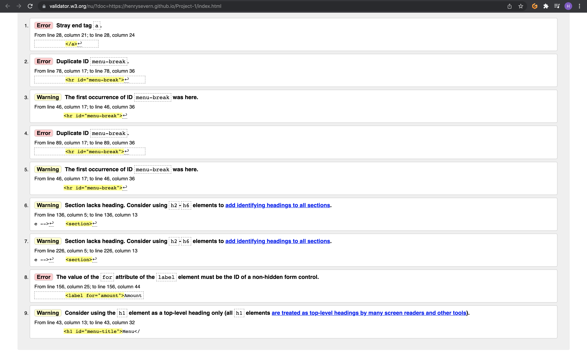
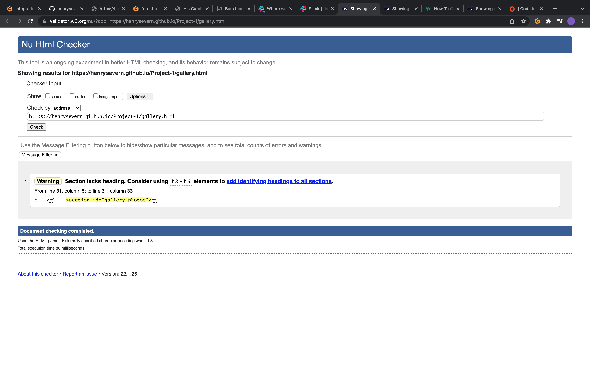
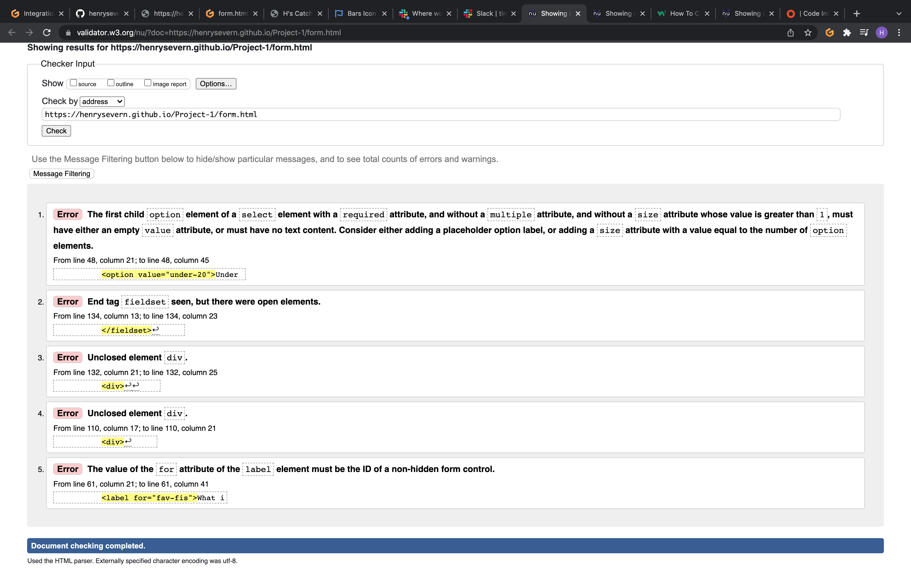
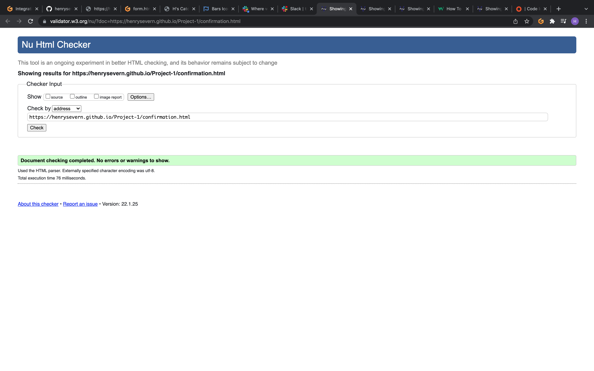
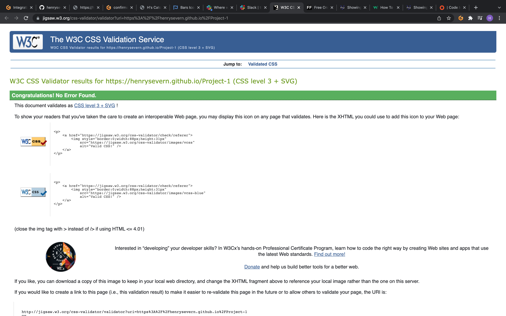
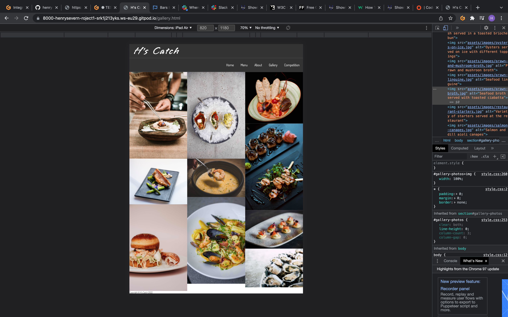
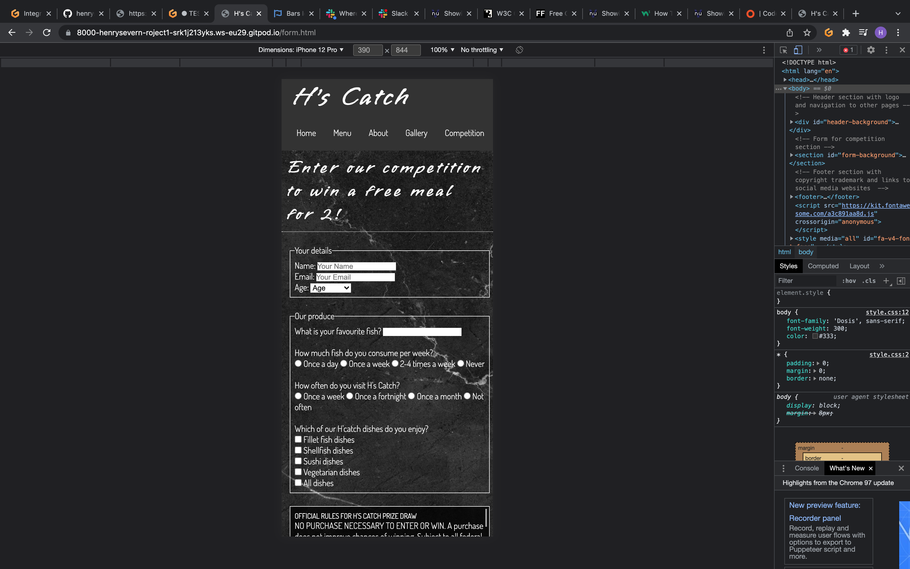
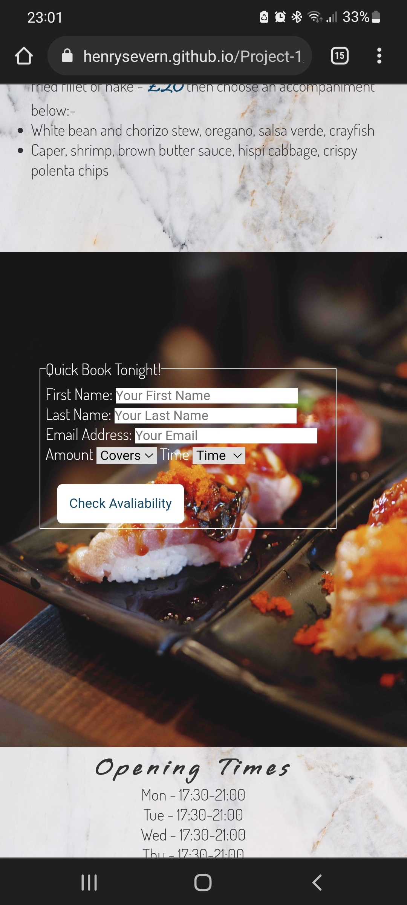

## Code Validation
All code for HTML has been validated through validator.w3 and CSS through jigsaw.w3 and errors have been fixed.

Few errors in index.html have been fixed - ID "menu-break" for some hr elements error was fixed by just using a overall style for all hr elements instead of an ID attribute. Stray 'a' tags were removed and the 'for' attribute on the quick book section 'amount' was changed to 'covers'.

No errors in gallery.html were found.

Few errors in form.html have been fixed - A few 'div' tags and a 'fieldset' tag were unclosed have been fixed. The error with the code in the option menu for the 'Age' question was fixed by adding a placeholder option of 'option value="" selected disabled>Age /option'.

No errors in confirmation.html were found

No errors in style.css were found.

## Browser Compatibility

The website has been tested on 3 different browsers - Chrome, Firefox and Safari. All web browsers respond to the webiste the same and no bugs show up.

## Responsiveness

The website has been tested over desktop, tablet and mobile devices. The media queries allow the website to display organised and clean throughout all devices. Some provided screenshot below using chrome dev tools and also a screenshot from my phone (Samsung Galaxy S20 Ultra).

Desktop;

Tablet;

Mobile;

Samsung Galaxy S20 Ultra 

